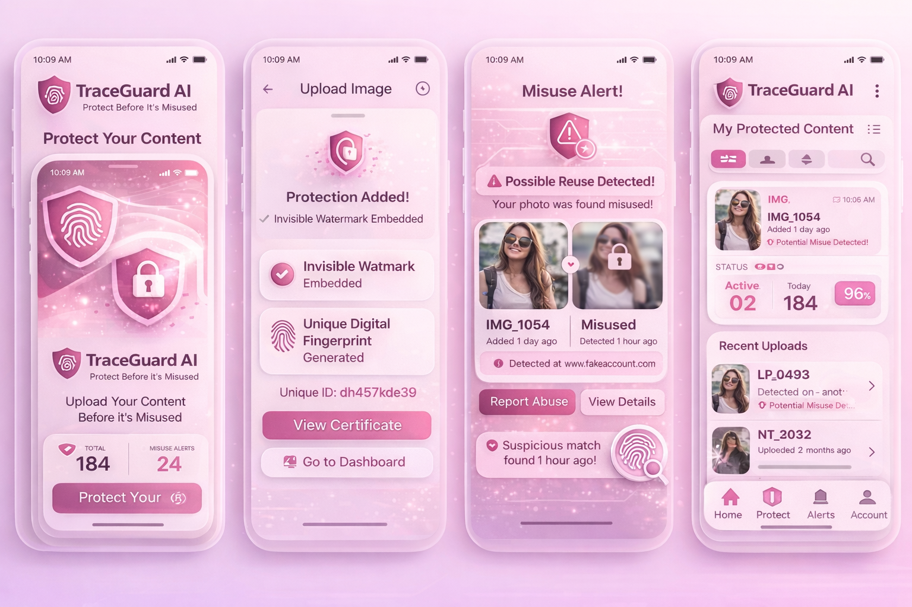

# TraceGuard AI

AI-powered image protection platform that helps you protect your digital content with invisible watermarks and fingerprinting technology.



## Features

- **AI-Powered Watermarking** - Embed invisible watermarks in your images
- **Fingerprinting Technology** - Unique content identification for tracking
- **Duplicate Detection** - Automatically detect unauthorized copies
- **Real-time Alerts** - Get notified when your content is found elsewhere
- **Dashboard Analytics** - Track protection status and detections
- **Progressive Web App** - Install on any device for quick access

## Tech Stack

- **Frontend**: Next.js 16, React 19, TypeScript, Tailwind CSS 4
- **UI Components**: shadcn/ui, Radix UI, Framer Motion
- **Backend**: Next.js API Routes, Prisma ORM
- **Database**: SQLite (development) / PostgreSQL (production)
- **Authentication**: NextAuth.js
- **Analytics**: Firebase Analytics, Firestore
- **Storage**: Firebase Storage

## Getting Started

### Prerequisites

- Node.js 18+ or Bun
- npm, yarn, or bun

### Installation

1. Clone the repository:
```bash
git clone https://github.com/YOUR_USERNAME/traceguard-ai.git
cd traceguard-ai
```

2. Install dependencies:
```bash
npm install
# or
bun install
```

3. Set up environment variables:
```bash
cp .env.example .env
```

4. Update `.env` with your credentials:
```env
DATABASE_URL="file:./dev.db"

# Firebase Configuration
NEXT_PUBLIC_FIREBASE_API_KEY="your-api-key"
NEXT_PUBLIC_FIREBASE_AUTH_DOMAIN="your-project.firebaseapp.com"
NEXT_PUBLIC_FIREBASE_PROJECT_ID="your-project-id"
NEXT_PUBLIC_FIREBASE_STORAGE_BUCKET="your-project.appspot.com"
NEXT_PUBLIC_FIREBASE_MESSAGING_SENDER_ID="your-sender-id"
NEXT_PUBLIC_FIREBASE_APP_ID="your-app-id"
NEXT_PUBLIC_FIREBASE_MEASUREMENT_ID="your-measurement-id"

# NextAuth.js
NEXTAUTH_SECRET="your-nextauth-secret-here"
NEXTAUTH_URL="http://localhost:3000"
```

5. Initialize the database:
```bash
npx prisma db push
```

6. Run the development server:
```bash
npm run dev
```

7. Open [http://localhost:3000](http://localhost:3000) in your browser.

## Demo Credentials

- Email: `demo@traceguard.ai`
- Password: `demo123`

## Deployment

### Deploy to Vercel

1. Push your code to GitHub
2. Import your repository on [Vercel](https://vercel.com)
3. Add environment variables in Vercel dashboard
4. Deploy!

[](https://vercel.com/new/clone?repository-url=https://github.com/YOUR_USERNAME/traceguard-ai)

### Production Database

For production, use a managed PostgreSQL database:
- [Neon](https://neon.tech) - Serverless PostgreSQL
- [PlanetScale](https://planetscale.com) - Serverless MySQL
- [Supabase](https://supabase.com) - PostgreSQL with additional features

Update your `DATABASE_URL` environment variable in Vercel.

## Project Structure

```
├── prisma/
│   └── schema.prisma      # Database schema
├── public/
│   └── ...                # Static assets
├── src/
│   ├── app/
│   │   ├── api/           # API routes
│   │   ├── page.tsx       # Home page
│   │   └── layout.tsx     # Root layout
│   ├── components/
│   │   ├── ui/            # UI components (shadcn)
│   │   └── ...            # Custom components
│   └── lib/
│       ├── firebase.ts    # Firebase config
│       └── ...            # Utilities
├── .env.example           # Environment template
├── vercel.json            # Vercel config
└── package.json
```

## Contributing

Contributions are welcome! Please feel free to submit a Pull Request.

## License

This project is licensed under the MIT License.

---

Made with ❤️ by TraceGuard AI Team
